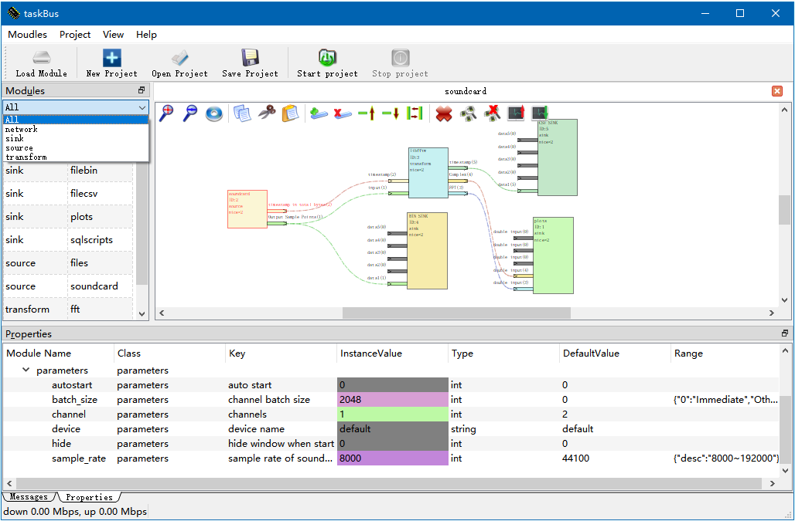
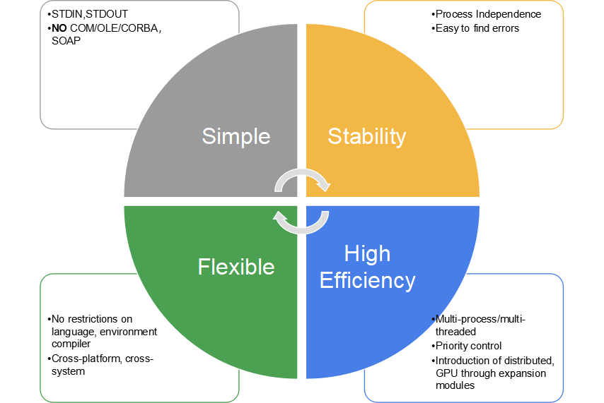
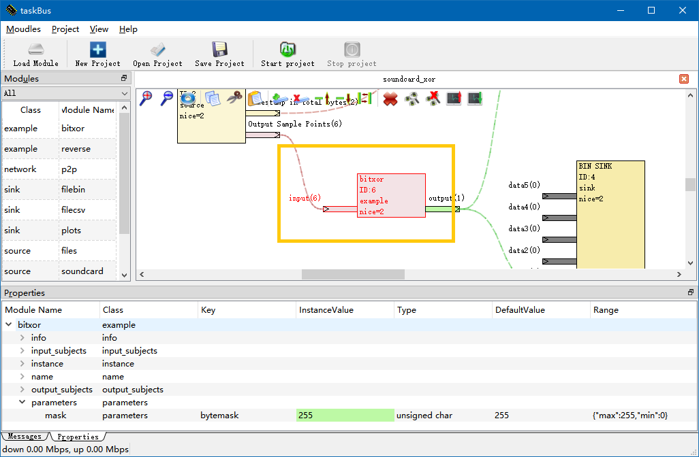

# Taskbus - A cross platform multi-process cooperation framework

[TOC]

## 1. What is TaskBus

Taskbus is a cross-platform multi-process cooperation framework for non-professional developers, with four features of **process based, language independent, compiler independent, and architecture Independent**.

The **non-professional developer **is a general concept that can be understood as a developer without specialized software engineering training. For example, the university's research team, which needs to develop its own small tools for algorithm validation, and to conduct data analysis in a field (chemical, mechanical, communications, electronics, etc.), requires a long-term team of engineers working on non-consumer tool software development.

Taskbus provides a modular drag-and-drop interface like Simulink or gnu-radio that can be used to implement (quasi-)real-time processing logic on a general-purpose computer. However, structurally, it is completely different from the two. It provides a process management platform by defining a feature release and data exchange standard to combine processes developed in different languages. In the example, you can see modules generated by tool chains such as Python2/3,nodejs,c#,gnuoctave, Qt, C + +, MFC, and so on. The platform put them together and do things well.



## 2. Key Features
The core idea of Taskbus is “Define IO Standard instead of toolchain to be used, define connection structure instead of architecture or algorithm. ”

1. Taskbus only defines the method and format of data exchange, and does not require the implementation of language and operation environment. This brings a very high level of flexibility.
2. Taskbus defines only the logical connection structure between processes and does not define the architecture and methods required for specific features built by the user.

Key Features： 

- **Simple**: The process accepts initialization parameters via command-line parameters. Working data io is directly based on standard input-output (STDIN,STDOUT,STDERR). There is no knowledge requirement for databases, COM, CORBA, dynamic links, soap, or network protocols. Based on the debugging function provided by the platform, the logic of each module can be debugged independently from the platform after recording and playback.
- **Flexible**: Through the concept of '*Subject and Path*', multiple logical data can share a pair of pipelines at the same time . The relationship between them is entirely determined by the module designer. Based on the functions provided by the network module and the database module, the distributed processing system can be built on different operating systems. You can even wrap the MATLAB, Octave, and Python programs in a wrapper.
- **Stability**: Errors are controlled within a module process and are easy to spot problems. Independent priority (NICE) can be set for each module.
- **High Efficiency**: Multi-process parallel, distributed computing and priority control, so that the general-purpose PC computing environment can also achieve real-time processing/quasi-real-time processing capabilities. When your module joins features such as GPU acceleration, you can significantly improve the performance of your entire system.
- **Push instead of request**: Unlike Gnu-radio, Taskbus front module pushes data to back module proactively. The data flow control is implemented by the module in a simple way(Refer to the "Load Control" section below).



## 3. Basic Principle
Many of the classic programming language cookbooks are  started from the console. The console program receives user input through the keyboard and prints the result of the operation to the screen. In fact, the process starts with three special file handles available, whether in Linux or Windows. They are standard output (stdout), standard input (stdin), standard error (STDERR). 

Most modern languages support the creation of child processes, and can take over  child processes' standard pipelines through "pipeline redirection" technology. Taskbus technology, which is based on this feature, reads data from the stdout of each child process and forwards it to the required subprocess (stdin).

### 3.1 Input and Output

A textbook C program that implements XOR operations is generally similar to this:

```cpp
#include <stdio.h>
int main(int argc, char *argv[])
{
	unsigned int a[4];
	scanf("%u,%u,%u,%u",a,a+1,a+2,a+3);
	for(int i = 0; i < 4; ++i)
		a[i] = 0xFFFFFFFF ^ a[i];
	printf("%u,%u,%u,%u\n",a[0],a[1],a[2],a[3]);
	return 0;
}
```

The program above input four numbers from the keyboard, take the inverse, output them to screen. Because the keyboard is associated with the stdin, the screen is associated with the stdout, which is essentially equivalent to the following program:

```cpp
	fscanf(stdin,"%u,%u,%u,%u",a,a+1,a+2,a+3);
	fprintf(stdout,"%u,%u,%u,%u\n",a[0],a[1],a[2],a[3]);
```

The input and output of the Taskbus module is very similar to the above program. There is only one difference, that binary read and write functions is used instead of text edition:
```cpp
	unsigned int a[4];
	fread(a,sizeof(int),4,stdin);
	for(int i = 0; i < 4; ++i)
		a[i] = 0xFFFFFFFF ^ a[i];
	fwrite(a,sizeof(int),4,stdout);
```

### 3.2 Subjects and Paths
A child process has only one pair of input and output pipelines. By introducing the concept of *Subjects and Paths*, multiple content can be transmited through one channel .

#### 3.2.1 Subjects

*Subject* indicates a class of data. such as the waveform collected by the sound card, and the stream of bytes read from the file.

On the graphical interface, the Subjects is shown as a pin. Each Subjects has a memorable name; at run time, the Taskbus platform sets an integer ID for each Subject based on the connection relationship. The input and output pins with the same ID will be connected.


A Subject producer generates data and gives it to the platform. The platform gives the data to all consumers connected to the Subjects.
**NOTE:** Different pins can produce the same Subject ID, and can also listen to a same ID. For the Producers, the act of doing so is consistent. For consumers, how to deal with the same subject ID, depending on the module implementation.

#### 3.2.2 Paths

Path distinguishes an independent natural sequence in a class of topics. In the example below, the data collected by the two sound cards are remitted into the same FFT converter. For converters, it is necessary to distinguish between two natural timing sequences in order not to cause confusion.


The sound card module in the image above uses its own process ID (2, 6) as the path number, which makes it very convenient to calibrate the source of the data.

### 3.3 IO with Subjects and Paths

Given the above, we can implement stdio-based communication with a slight modification in the preceding code.
```cpp
void record( char a[], int data_len, int path_id)
{
	int out_subject_id, out_path_id;
	int out_data_len;
	char b[MAX_LEN];
	deal(a, datalen,path_id,
		 &out_subject_id,
		 &out_path_id,
		 &out_data_len,
		 b
		 );
	fwrite (&out_subject_id,sizeof(int),1,stdin);
	fwrite (&out_path_id,sizeof(int),1,stdin);
	fwrite (&out_data_len,sizeof(int),1,stdin);
	fwrite (b,sizeof(char),out_data_len,stdin);
}
int main(int argc, char *argv[])
{
	int subject_id, path_id;
	int data_len;
	char a[MAX_LEN];
	while (!finished())
	{
		fread (&subject_id,sizeof(int),1,stdin);
		fread (&path_id,sizeof(int),1,stdin);
		fread (&data_len,sizeof(int),1,stdin);
		fread (a,sizeof(char),data_len,stdin);
		switch (subject_id)
		{
		case ID_WAV:
			record(a,data_len,path_id);
			break;
		case ID_DAT:
			deal(a,data_len,path_id);
			break;
		default:
			break;
		}
	}
	return 0;
}

```

The above code lacks context, but clearly illustrates the most basic communication principle of taskbus. Between the different modules, it is through this method of communication.

### 3.4 Function publish
taskBus modules are developed independently by the developer. A JSON file is required to publish its own functionality to platform. In this way, the platform knows the types of topics supported by the module, parameter options.
A typical function description file must consist of three parts, namely:
1. Parameter table
2. Input Subjects Sheet
3. Output Subjects Sheet
Other user-defined sections can still be read and displayed on the platform, but with no practical meaning. The HelloWorld example provided by the platform contains two functions, one is bit or the other is sequential inversion. The structure of the JSON file is as follows:


```json
{
    "example_bitxor":{
        "name":"bitxor",
        "parameters":{
             "mask":{
                "type":"unsigned char",
                "tooltip":"bytemask",
                "default":255,
                "range":{
                    "min":0,
                    "max":255
                }
            }
        },
        "input_subjects":
        {
            "data_in":{
                "type":"byte",
                "tooltip":"input"
            }
        },
        "output_subjects":{
            "data_out":{
                "type":"byte",
                "tooltip":"output"
            }
        },
        "info":{
            "auther":"kelly",
            "version":[1,0,0],
            "mail":"kelly@163.com"
        }
    },
    "example_reverse":{
        "name":"reverse",
        "parameters":{
         },
        "input_subjects":
        {
            "data_in":{
                "type":"byte",
                "tooltip":"input"
            }
        },
        "output_subjects":{
            "data_out":{
                "type":"byte",
                "tooltip":"output"
            }
        },
        "info":{
            "auther":"kelly",
            "version":[1,1,0],
            "mail":"kelly@163.com"
        }
    }
}

```

As you can see, the file consists of two chunks. The first block is the Example_bitxor part, the second block is Example_reverse, which corresponds to two functions.

Within each function, the four sub-items (name, parameters, Input_subject, Output_subject) , respectively, corresponding to the friendly name, static properties, input subjects, output subjects.

**NOTE:** Although each property contains a type indication of "type" and a range indication, the platform considers all input output as a byte stream. "type" and "range" is only intended to alert the user. A mature module should have a detailed interface document describing the input and output type, byte order, and size end. For text type, character set is very important. The above module, shown on the platform as:


### 3.5 Command-line arguments

The Taskbus platform initiates the process based on the JSON file. When you start each function module, Taskbus feeds all the information through the command line parameters. There are several types of command-line arguments.

| Tyoe|Paraments | Meaning | Comment |
|----|----|--------|------|
|Process|----instance=<M>| Feeds the module to the process ID value | Used to differentiate between separate processes, this measure avoids the module itself to generate a unique ID |
|Process|----function=<N>| Specifies the function that the current instance should run.|A module can support many functions.|
|Process|----information| The platform Request module outputs JSON description and exits.|The module can be supplied with JSON files, or printf JSON in this parameter.|
|Subjects|----<sub_name>=<K>| Specify the ID of the Subject name to the module| The Subject name is determined by each module and can appear in multiple sections.|
|User Properties|----<Key>=<Value>|User-defined initialization properties|Can be set in the platform "Properties" column.|

As an example of the hello-world module, the following module, at startup, has the following command line:

```bash
user@local$ example_helloworld.exe --instance=6 --function=example_bitxor --mask=255 --data_in=6 --data_out=1
```


### 3.6 First Hello-world module

We paste the code of the Hellowold module here, using C + +, it is very convenient to implement the above functions.
- The code does not use any features other than the standard C + +
- in fact, in the fourth chapter you can see that we have done a lot of simplification for the access platform in advance. But simplifying the work will obscure the details, and the following code is still a good example of how the module works.

```cpp
#include <cstdio>
#include <string>
#include <cstring>
#include <cstdlib>
#ifdef WINNT
#include <io.h>
#include <fcntl.h>
#endif
using namespace std;
#define MAX_DTALEN 65536
int main(int argc, char * argv[])
{
	//In windows, stdio must be set to BINARY mode, to
	//prevent linebreak \\n\\r replace.
#ifdef WINNT
	setmode(fileno(stdout),O_BINARY);
	setmode(fileno(stdin),O_BINARY);
#endif
	bool bInfo = false, finished = false;
	int instance = 0;
	int sub_input = 0, sub_output = 0;
	char mask = 0;
	string function;
	//1. parse cmdline
	for (int i=1;i<argc;++i)
	{
		string arg_key = argv[i], arg_value = argv[i];
		int idx = arg_key.find('=');
		if (idx>=0 && idx<arg_key.size())
		{
			arg_key = arg_key.substr(0,idx);
			arg_value = arg_value.substr(idx+1);
		}
		if (arg_key=="--function")
			function = arg_value;
		else if (arg_key=="--information")
			bInfo = true;
		else if (arg_key=="--instance")
			instance = atoi(arg_value.c_str());
		else if (arg_key=="--data_in")
			sub_input = atoi(arg_value.c_str());
		else if (arg_key=="--data_out")
			sub_output = atoi(arg_value.c_str());
		else if (arg_key=="--mask")
			mask = atoi(arg_value.c_str());
		fprintf(stderr,"%s:%s\n",arg_key.c_str(),arg_value.c_str());
		fflush(stderr);
	}
	//2. function case
	if (bInfo)
	{
		//In this example, json file will be published with exe file.
		//We will return directly.  Or, you can output json here to stdout,
		//If you do not want to publish your json file.
		return 0;
	}
	else if (instance<=0 || function.length()==0)
		return -1;
	else
	{
		char header[4], data[MAX_DTALEN+1];
		memset(data,0,MAX_DTALEN+1);
		int n_sub = 0, n_path = 0, n_len = 0;
		while(false==finished)
		{
			fread(header,1,4,stdin);	//2.1 read header
			if (header[0]!=0x3C || header[1]!=0x5A || header[2]!=0x7E || header[3]!=0x69)
			{
				fprintf(stderr,"Bad header\n");
				break;
			}
			fread(&n_sub,sizeof(int),1,stdin);
			fread(&n_path,sizeof(int),1,stdin);
			fread(&n_len,sizeof(int),1,stdin);
			if (n_len<0 || n_len >MAX_DTALEN)
			{
				fprintf(stderr,"Bad length %d\n",n_len);
				break;
			}
			fread(data,sizeof(char),n_len,stdin);

			if (n_sub<=0)
			{
				if (strstr(data, "quit")!=nullptr)
				{
					finished = true;
					continue;
				}
			}
			else if (n_sub != sub_input)
				continue;

			if (function=="example_bitxor")
			{
				for (int i=0;i<n_len;++i)
					data[i] ^= mask;
			}
			else if (function=="example_reverse")
			{
				for (int i=0;i<n_len/2;++i)
				{
					char t = data[i];
					data[i] = data[n_len-1-i];
					data[n_len-1-i] = t;
				}
			}
			else
			{
				fprintf(stderr,"Unknown function %s\n",function.c_str());
				break;
			}
			fwrite(header,1,4,stdout);
			fwrite(&sub_output,sizeof(int),1,stdout);
			fwrite(&n_path,sizeof(int),1,stdout);
			fwrite(&n_len,sizeof(int),1,stdout);
			fwrite(data,sizeof(char),n_len,stdout);
			fflush(stdout);
		}
	}
	//3.exit
	return 0;
}

```

## 4. Development Guide

We will take FFTW as an example of how to create a Taskbus module from 0 onwards.

### 4.1 Design functions and writing JSON file

The first step in creating a module is to design the function and determine the interface, properties, and composition of the JSON file. The quickest way to compose a JSON file is to modify it from an example and save it as a JSON file with the same name as the executable. Writing Asian characters with UTF-8 encoding facilitates loading speed. As long as there is a JSON file, even if the module is not fully implemented, you can see the effect on the platform. The FFT module that we want to design should have the following structure:


It has two input interface (Subject, "tmstamp_in" and "signal")  ,  three output interface ("tmstamp_out", "Spec in Comples", "FFT in dB"). You can support the user to configure three static parameters: the number of FFT points, input signal bands, sample data type . These static parameters can be modified in the "Properties" section when the user clicks the icon, similar to the following image:


The feature description file with the above features is as follows:

```json
{
    "transform_fft":{
        "name":"libfftw",
        "parameters":{
		     "sptype":{
                "type":"enum",
                "tooltip":"sample point format",
                "default":0,
				"range":{
                    "0":"16 bit Intel",
                    "1":"16 bit Moto",
                    "2":"int8",
                    "3":"uint8"
				}
            },
             "channels":{
                "type":"int",
                "tooltip":"Channels",
                "default":1
            },		    
			"fftsize":{
                "type":"int",
                "tooltip":"fft size",
                "default":1024
            }

        },
        "input_subjects":
        {
            "signal":{
                "type":"byte",
                "tooltip":"signal"
            },
			"tmstamp_in":{
                "type":"unsigned long long",
                "tooltip":"tmstamp_in"
            }
        },
        "output_subjects":{           
            "FFT":{
                "type":"vector",
                "tooltip":"FFT in dB"
            },
            "Spec":{
                "type":"vector",
                "tooltip":"Spec in Complex"
            },
            "tmstamp_out":{
                "type":"unsigned long long",
                "tooltip":"tmstamp_out"
            }

        }
    }
}

```

Once you have the JSON file, you can load and edit it on the platform as long as you have a blank executable file (with the same file name and extension). Of course it does not work unless we go on with following chapters.

### 4.2 Accelerate development progress with toolcodes

If you use feature-rich languages such as C #, it is easier to do operations such as command-line parsing. For C++, taskBus platform provides source code that can directly accelerate development speed. Using these source codes will significantly improve development efficiency and simplify the amount of code.

#### 4.2.1 Command Line Interpretation

The first step in implementing module functionality is to get command-line arguments. You can use HelloWorld code to implement command-line parsing, but that makes it more complicated. Using the provided classes, command-line parsing and extraction becomes very simple. Whether it is QT, C++ or MFC, you can take similar measures.

```cpp
#include "cmdlineparser.h"
#include "tb_interface.h"
using namespace TASKBUS;
int main(int argc , char * argv[])
{
	init_client();
	cmdlineParser args(argc,argv);
	if (args.contains("information"))
		putjson();
	else if (args.contains("function","tranform_fft"))
	{
    	const int instance		= args.toInt("instance",0);
        const int isource		= args.toInt("signal",0);
        const int FFT		  	= args.toInt("FFT",0);
        const int Spec 			= args.toInt("Spec",0);
        const int itmstamp_in  = args.toInt("tmstamp_in",0);
        const int itmstamp_out = args.toInt("tmstamp_out",0);
        const int sptype	=	args.toInt("sptype",0);
        const int channels	=	args.toInt("channels",1);
		const int fftsize	=  args.toInt("fftsize",1024);
		//...work
	}
	else
		fprintf(stderr,"Error:Function does not exits.");
    return 0;
}
```

For examples of QT, MFC, C#, you can refer to sample projects.

#### 4.2.2 Data sending and receiving

The data throughput format for Taskbus is fixed. It strictly follows the following order:

|package| record | type |length(bytes) | meaning |
|--------|--------|--------|---------|---------|
|1| header |  unsigned char [4]|4  |Always be 0x3C,0x5A,0x7E,0x69 for debug with WINHEX|
|1| subject_id|  int |4  | 0: Control commands, >0:user subjects, <0 reserved|
|1| path_id|  int |4  | >=0:user subjects, <0 reserved|
|1| data_len|  int |4  | >0, following data length in bytes|
|1| data| unsigned char |  data_len | >0, data in bytes|
|2| header |  unsigned char [4]|4  | 0x3C,0x5A,0x7E,0x69|
|2| subject_id|  int |4  | 0: Control commands, >0:user subjects, <0 reserved|
|2| path_id|  int |4  | >=0:user subjects, <0 reserved|
|2| data_len|  int |4  | >0, following data length in bytes|
|2| data| unsigned char |  data_len | >0, data in bytes|
|3...||||||

Using tool code, you can do data sending and receiving directly. The main push functions are:


```cpp
    void push_subject(
	    const unsigned int subject_id,
	    const unsigned int path_id,
	    const unsigned int data_length,
	    const unsigned char   *dataptr
	    );
    void push_subject(
	    const unsigned int subject_id,
	    const unsigned int path_id,
	    const char   *dataptr
	    );
    void push_subject(
	    const unsigned char   *allptr,
	    const unsigned int totalLength
	    );
    void push_subject(
	    const subject_package_header header,
	    const unsigned char   *dataptr
	    );
```

The receive function (blocking) is:

```cpp
   std::vector<unsigned char> pull_subject(  subject_package_header * header  );
```

**Performance Tip:**The function above returns a vector directly that contains the data content of a complete packet (excluding the head). Because the c++14 above standard is used by default, returning std::vector<unsigned char> does not result in a deep memory copy, but rather triggers a right value reference with memory delivery.

The sending and receiving code snippet using the tool functions described above is as follows:

```cpp
		while (false==bfinished)
		{
			subject_package_header header;
			vector<unsigned char> packagedta = pull_subject(&header);
			if (is_valid_header(header)==false)
            	break;
			if ( is_control_subject(header))
			{				
				if (strstr(control_subject(header,packagedta).c_str(),"\"quit\":")!=nullptr)
					bfinished = true;
			}
			else if (header.subject_id==source)
			{
            	//...fft
                //output
				if (FFT>0)
					push_subject(FFT,header.path_id,fftsize*sizeof(double),(const unsigned char *)vec_fft_abs.data());
				if (Spec>0)
					push_subject(Spec,header.path_id,fftsize*sizeof(double),(const unsigned char *)out);
			}
		}
```

#### 4.2.3 Debugging

Tracking debugging from a platform process is very complex. Even for a simple module, you must roam through the binary machine code developed by the compiler in different languages. Fortunately, Taskbus offers a very clever and simple offline debugging solution that allows you to debug the module itself individually and connect to the platform at any time.

The core idea of debugging is the overloading of the input and output pipeline. taskBus platform can record all the input and output data, command-line startup parameters and other features of a module to disk as needed. Then, when you debug the platform, you can implement scene playback whenever you specify a recording folder.

##### (1)Turn on debug and recording data

Selecting the module in the main interface and clicking the Start Debugging button will turn on the recording.


Once the entire project starts running, the recorded data is continuously recorded in the Debug folder. The subfolder is named as the current operating system process ID. There are 3 files under the folder, corresponding to Stdin,stdout,stderr. Note that in order to capture all exceptions, the platform will remain exclusive to the log files until the next debug starts running. Therefore, in order to end recording, you need to close the platform or start the project again.


##### (2)Playback and debugging

The key technology is based on "freopen()". This feature redirects the actual source to the file while keeping the file handle unchanged. The user can implement it himself through a statement, and once the following statement is executed, the data throughput section of the above will automatically use the data recorded in the file:

```cpp
	std::string fm_stdin = strpath + "/stdin.dat";
    freopen(fm_stdin.c_str(),"rb",stdin);
```

For CPP, the platform is ready for handy tool functions. A code that supports switching debug mode, Normal mode, only needs to add a few lines of code to the main portal:

```cpp
using namespace TASKBUS;
const int OFFLINEDEBUG = 0;
int main(int argc , char * argv[])
{
	init_client();
	cmdlineParser args;
	if (OFFLINEDEBUG==0)
		args.parser(argc,argv);
	else
	{
		auto ars = debug("debug/pid21580");
		args.parser(ars);
	}
    //...
}
```

In the code above, the previously recorded command-line arguments and input data are read from the debug/pid21580 folder. This way, you can debug it independently. Don't forget to set the debug switch OFFLINEDEBUG to 0 after you finish debugging.

### 4.3 Data Processing

In the preceding example, data is Immediately processed, that is the simplest case. In many scenarios we need to deal with data cache and multiplex processing problems. Load control is also an issue to consider for a large data flow or time-consuming operation.

#### 4.3.1 Data Caching recommendations

It is recommended to use the STL library.

- If you need to cache old data, using the STL container is a very suitable choice.
- For different paths (path_id), the cache should be independent. At this point, std::map<path_id, cache> will provide very good maneuverability.
- use nested map, vector, list to implement very complex dynamic data structures.
- It's also a good idea to use the smart pointer "shared_ptr".

#### 4.3.2 Load control

Unlike Gnuradio’s pulling, Taskbus producers push the data. When computing resources are abundant, designers do not need to consider the problem of load control. However, in time-consuming processing, if there is no measure to protect, the bottleneck module may result in increasing memory overhead across the platform. Producers continue to write to stdout, the platform output to the consumer's stdin, seemingly no problem. In fact, under Windows, the platform writes the cache of the operating system. If consumers are unable to consume the cache in a timely manner, the cache will continue to grow.

For flexibility reasons, Taskbus left the issue to the module designer. Module designers can solve this problem with at least two simple strategies.

- Method 1, by setting the signal source rate, ensure that the signal is less than the processing limit of the rate of generation.

- Method 2, The consumer outputs the data timestamp and interconnects it back to the producer to form a closed loop. The producer detects the back of the connection timestamp. If significantly lower than the current production schedule, the producer slows down the production schedule.

Strategy 2 is used for the following example project.Technical details Reference Sample project Source_soundcard.


### 4.4 Runtime and deploy

The Taskbus runtime provides a traversal for Green Publishing (Copy-deployment), and developers can adjust the path settings by referring to the following sections.

#### 4.4.1 Path Policy

The current path will be changed to the path where the Taskbusplatform executable file is located when the platform started. Taskbusplatform reads all known modules that are listed in Default_mods.text . In this file, each row stores the executable file location of a module, and an example looks like this:


```text
../../../examples/voice_spec.exe
modules/network_p2p.exe
modules/sink_file.exe
modules/example_helloworld.exe
modules/source_files.exe
modules/transform_fft.exe
modules/sink_SQL.exe
modules/source_soundcard.exe
modules/sink_plots.exe
```

Taskbusplatform will try to use relative path unless the character length of the absolute path is less than the relative path. Therefore, for a system that needs to be published, you can place all modules in the path where the Taskbusplatform executable file is located. Managed with subfolders such as folder modules or subs is a good way. Once you've done this, copy it to a new computer and run it without setting it up.

#### 4.4.2 Sub-Projects and nesting

a taskBus project can be referenced by other projects. All suspended pins are assigned temporary IDs and exposed for external engineering links. Taking the FFT of the sound card as an example, we can combine the sound card and FFT into a "sound spectrum" module.

##### (1) Create a sub project

Create a new subproject with the following structure:


- This subproject consists of two modules, a sound card module and a FFT module.
- The output pin of the FFT module is suspended as the external interface of the subproject.
- If there are two suspended interfaces of the same name, the IDs assigned by the corresponding process are used to make the distinction.

Save this subproject as a TBJ file, such as "VOICE_SPEC.TBJ".

##### (2) Attach a wrapper file

Copy the wrapper "Subtask_warpper.exe" that comes with the platform to the same folder as "Voice_spec.tbj", named "Voice_spec.exe"

- Voice_spec.exe will automatically read VOICE_SPEC.TBJ and tell the platform its own interface.
- Under Linux, there is no exe extension.

##### (3) Attach default module load script

Since voice_spec needs to load the module itself, it is necessary to copy the Default_mods.text under the TaskBusPlatform.exe folder to the same folder as "voice_spec.tbj", named "voice_spec.text"

- because the current running path of the platform is always the path of taskBusPlatform.exe, the relative path in the file Voice_spec.text remains the same as Default_mods.text. Users do not need additional editing.

- However, you still need to review the file file Voice_spec.text to clear useless entries.
- **In particular, it is important to note that the entry line for the Voice_spec module cannot be included in the file Voice_spec.text. This results in recursive loading, starting hundreds of child processes to slow down the system**

When 2 and 3 are complete, the folder looks like this：


File Voice_spec.text was modified to:

```text
modules/source_soundcard.exe
modules/transform_fft.exe
```

##### (4) Load Subproject into taskBusPlatform

After you load the subproject module "Voice_spec.exe" in the platform, you can drag the module into the design area as a whole:


- Double-click the Voice_spec icon can open the subproject.

### 4.5 Multi-platform, distributed and scalable
The Taskbus core uses Qt development and is a cross-platform structural framework that can run on all platforms that support Qt. At the same time, through the introduction of the corresponding modules, Taskbus can be more convenient to achieve distributed computing. In the code example, a TCP-based point-to-point transport module and a database logging module that accepts SQL scripts are included.

In addition to supporting the use of C + +, C #, VB and other compiled languages, Taskbus can also be directly referenced by the wrapper Python,lua,perl,ruby,matlab as a module, very flexible.

Specific examples refer to the accompanying code.

## 5 About Taskbus

**Copyright protection and commercial use**

Taskbus itself is an open standard software system that follows the LGPL protocol, but does not specify the license type of the module.

If you are publishing a commercial module, please complete their own registration certification, activation and other functional design.

Developed by Goldenhawking Studio, Welcome to join the active developer!

Email: goldenhawking@163.com

