# Taskbus - 一个跨平台的多进程合作框架

[TOC]

## 1. 什么是Taskbus
Taskbus 是一种面向非专业开发者的跨平台多进程合作框架，具有进程切割、语言无关、编译器无关、架构无关四个特点。

非专业开发者是一个泛泛的概念，可以理解为没有受过专业化的软件工程化训练的开发者。诸如需要频繁自行开发小工具进行算法验证的高校教研团队，以及深入某一领域（化工、机械、通信、电子等）进行数据分析，需要长期从事非消费类工具软件开发的工程师团队。

Taskbus 从感官上提供一种类似Simulink或GNU-Radio的模块化拖拽界面，可用于在通用计算机上实现准实时的处理逻辑。但是，从结构上，其与二者完全不同。Taskbus 对编译器、运行平台、开发语言不做要求。它通过定义一种功能发布与数据交换标准，提供一套进程管理平台，以便把不同语言开发的进程组合起来。在例子中，您可以看到Python2/3，NodeJS，C#，GNUOctave、Qt、C++、MFC等等工具链生成的模块，它们在平台统一调度下完成功能。

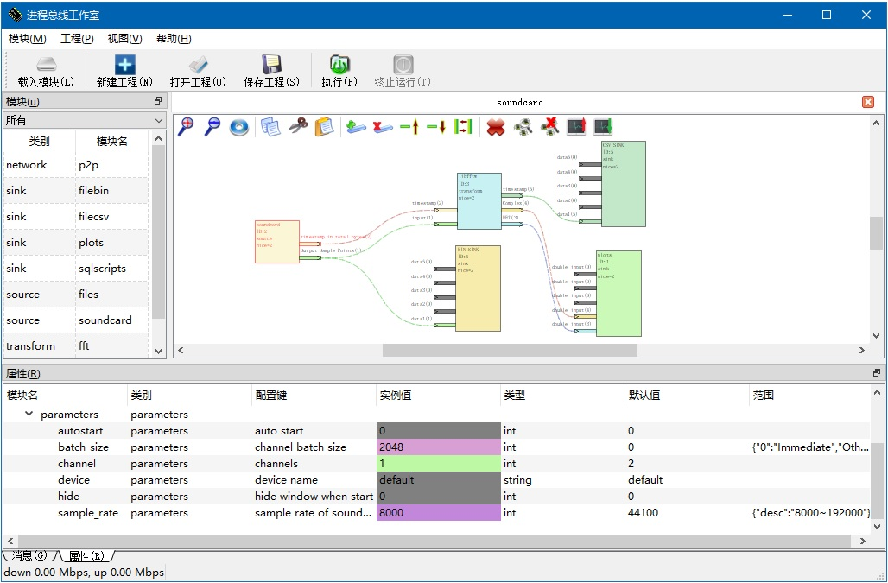

## 2. 关键特性
taskBus 的核心理念是 “定IO标准不定具体工具，定连接结构不定架构算法”
1. taskBus 仅定义数据交换的方法与格式，对具体实现语言、运行环境没有要求。这带来了非常高的灵活性。
2. taskBus 仅定义进程间的逻辑连接结构，并不定义用户搭建的具体功能所采用的架构、所需要的方法。
它的关键特性：

- **简单**： 进程通过标准输入输出（stdin,stdout,stderr）吞吐数据、命令行参数接受初始化参数。没有对数据库、COM、CORBA、动态链接、SOAP或网络协议的知识要求。基于平台提供的调试功能，经过录制、回放操作，可以脱离平台独立调试各个模块的逻辑。
- **灵活**： 通过专题（Subject）、通路（Path），通过标准输入输出管道可以分时处理多个逻辑流。它们之间的关系完全由模块设计者确定。基于网络模块、数据库模块提供的功能，可以在不同的操作系统上构建分布式的处理系统。您甚至可以用封装器把Matlab、Octave、Python程序包装进来。
- **稳定**： 错误被控制在一个模块进程内部，易于发现问题。 可为各个模块设置独立的优先级（nice）。
- **高效**:  多进程并行、分布式计算与优先级控制，使得通用PC计算环境也可达到实时处理/准实时处理的能力。当您的模块加入GPU加速等特性后，可以使整个系统性能得到大幅度提升。
- **推送而非请求**：与GNU-Radio不同，taskBus的前序模块主动向后端推送数据，而负荷控制由模块通过简单的方法实现（参考下文“负荷控制”部分）。

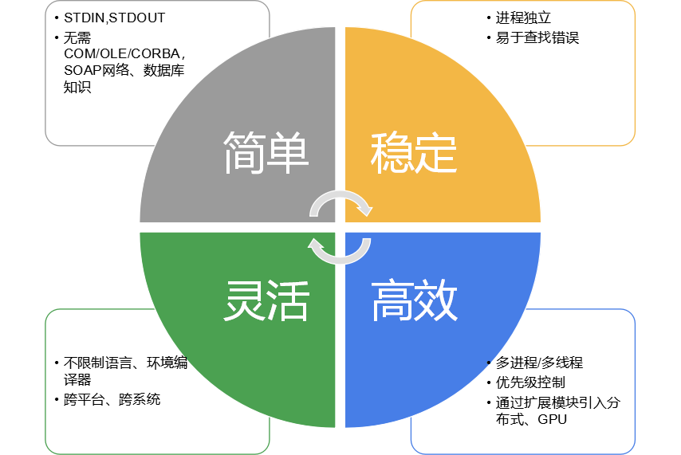

## 3. 基本原理
很多经典的编程语言课本都是从控制台开始的. 控制台程序通过键盘接收用户输入，向屏幕打印运算结果。事实上，无论在Linux还是Windows中，进程启动时便有三个特殊的文件句柄可用了。他们是标准输出(stdout)，标准输入(stdin)，标准错误(stderr)。默认情况下，stdin与键盘关联，stdout、stderr与屏幕关联。

大多数现代语言支持创建子进程, 并且可以通过 "管道重定向" 技术接管子进程的标准管道。Taskbus 技术即基于此特性，从各个子进程的stdout读取数据，并转发给需要的子进程（stdin）。

### 3.1 输入输出

一个实现XOR操作的教科书C程序，一般类似这样：

```cpp
#include <stdio.h>
int main(int argc, char *argv[])
{
	unsigned int a[4];
	scanf("%u,%u,%u,%u",a,a+1,a+2,a+3);
	for(int i = 0; i < 4; ++i)
		a[i] = 0xFFFFFFFF ^ a[i];
	printf("%u,%u,%u,%u\n",a[0],a[1],a[2],a[3]);
	return 0;
}
```

上面的程序里，从键盘输入四个数字，取反后输出。由于键盘与stdin关联，屏幕与stdout关联，上述程序实质上与下面的程序等效：
```cpp
	fscanf(stdin,"%u,%u,%u,%u",a,a+1,a+2,a+3);
	fprintf(stdout,"%u,%u,%u,%u\n",a[0],a[1],a[2],a[3]);
```
Taskbus 模块的输入输出与上述程序非常类似，唯一的区别是使用了二进制读写函数:
```cpp
	unsigned int a[4];
	fread(a,sizeof(int),4,stdin);
	for(int i = 0; i < 4; ++i)
		a[i] = 0xFFFFFFFF ^ a[i];
	fwrite(a,sizeof(int),4,stdout);
```

### 3.2 专题与通路
一个子进程只有一对输入输出管道。通过设置专题与通路，可以仅用一路管道分享多路内容。

#### 3.2.1 专题

专题（Subject）指示一类数据。如声卡采集的波形，以及从文件中读取的字节流。
在图形界面上，专题显示为管脚。每个专题有一个便于记忆的名字；在运行时，taskBus平台会根据连线关系，为每个专题设置一个整数ID。ID相同的输入、输出管脚会被连接起来。

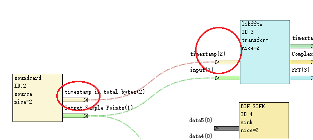

一个专题的生产者生成数据，交给平台。平台把数据交给所有连接了此专题的消费者。

**注意：** 不同的管脚可以生产同一ID的专题，也可以监听一个相同的专题。对生产者，这样做的行为是一致的。对消费者，如何处理专题ID相同的情况，取决于模块实现者。

#### 3.2.2 通路
通路(PATH)在一类专题中，区分一条独立的自然时序。下面的例子中，两路声卡采集的数据汇入同一个FFT变换器。对于变换器来说，需要区分出两条自然时序，才能不导致混淆。


上图中的声卡模块采用自身的进程ID（2、6）作为通路号，这样非常便捷地标定了数据的来源。

### 3.3 带有专题和通路的IO

鉴于上面的介绍，我们在前文代码中稍加修改，即可实现基于stdio的通信。

```cpp
void record( char a[], int data_len, int path_id)
{
	int out_subject_id, out_path_id;
	int out_data_len;
	char b[MAX_LEN];
	deal(a, datalen,path_id,
		 &out_subject_id,
		 &out_path_id,
		 &out_data_len,
		 b
		 );
	fwrite (&out_subject_id,sizeof(int),1,stdin);
	fwrite (&out_path_id,sizeof(int),1,stdin);
	fwrite (&out_data_len,sizeof(int),1,stdin);
	fwrite (b,sizeof(char),out_data_len,stdin);
}
int main(int argc, char *argv[])
{
	int subject_id, path_id;
	int data_len;
	char a[MAX_LEN];
	while (!finished())
	{
		fread (&subject_id,sizeof(int),1,stdin);
		fread (&path_id,sizeof(int),1,stdin);
		fread (&data_len,sizeof(int),1,stdin);
		fread (a,sizeof(char),data_len,stdin);
		switch (subject_id)
		{
		case ID_WAV:
			record(a,data_len,path_id);
			break;
		case ID_DAT:
			deal(a,data_len,path_id);
			break;
		default:
			break;
		}
	}
	return 0;
}

```
上述代码缺少上下文，但清晰的示意了taskBus最基本的通信原理。不同模块之间，正是通过这样的方法进行沟通的。

### 3.4 模块功能发布
由开发者独立开发的模块，需要使用JSON文件发布自己的功能。这样，平台就知道模块支持的专题类型、参数选项。
一个典型的功能描述文件必须包括三部分，分别是：
1. 参数表
2. 输入专题表
3. 输出专题表
其他用户自定义部分依旧可以读入并显示在平台，但没有实际的意义。 平台提供的helloworld例子包含两个功能，一个是比特抑或，一个是顺序取反。JSON文件的结构如下：

```json
{
    "example_bitxor":{
        "name":"bitxor",
        "parameters":{
             "mask":{
                "type":"unsigned char",
                "tooltip":"bytemask",
                "default":255,
                "range":{
                    "min":0,
                    "max":255
                }
            }
        },
        "input_subjects":
        {
            "data_in":{
                "type":"byte",
                "tooltip":"input"
            }
        },
        "output_subjects":{
            "data_out":{
                "type":"byte",
                "tooltip":"output"
            }
        },
        "info":{
            "auther":"kelly",
            "version":[1,0,0],
            "mail":"kelly@163.com"
        }
    },
    "example_reverse":{
        "name":"reverse",
        "parameters":{
         },
        "input_subjects":
        {
            "data_in":{
                "type":"byte",
                "tooltip":"input"
            }
        },
        "output_subjects":{
            "data_out":{
                "type":"byte",
                "tooltip":"output"
            }
        },
        "info":{
            "auther":"kelly",
            "version":[1,1,0],
            "mail":"kelly@163.com"
        }
    }
}

```

可以看到，文件由两大块组成。第一块为 example_bitxor部分，第二块为example_reverse，对应了两个功能。

在各个功能内部，又分name、parameters、input_subject、output_subject四个子项目，分别对应友好名称、静态属性、输入专题、输出专题。

**注意：**尽管各个属性含有“type”类型指示以及range取值范围指示，但平台把所有输入输出看做字节流，这些取值仅仅为了提醒用户。一个成熟的模块应该有详细的接口文档描述输入输出类型、字节序、大小端。对文本类型，要明确或者可以设施字符集。上面的模块，在平台上显示为：


### 3.5 命令行参数
taskBus 平台根据JSON文件启动进程。在启动各个功能模块时，taskBus 通过命令行参数送入所有的信息。命令行参数有如下几类。

| 类别|参数 | 意义 | 解释 |
|----|----|--------|------|
|进程|----instance=<M>| 向模块送入进程ID值 | 整形。用于区分独立的进程，这个措施避免了模块自己来生成唯一ID |
|进程|----function=<N>| 向模块指定当前实例开启的功能。|一个模块可以支持很多功能。|
|进程|----information| 平台请求模块输出JSON描述并退出。|模块既可以附带JSON文件，也可以在本参数中printf JSON。|
|专题|----<sub_name>=<K>| 向模块指定专题名对应的ID| 专题名由各个模块确定,可以出现多条。|
|用户属性|----<Key>=<Value>|用户自定的初始化属性|可在平台“属性”栏设置。|

以上述模块JSON为例子，下图中的模块，在启动时，命令行如下：
```bash
user@local$ example_helloworld.exe --instance=6 --function=example_bitxor --mask=255 --data_in=6 --data_out=1
```
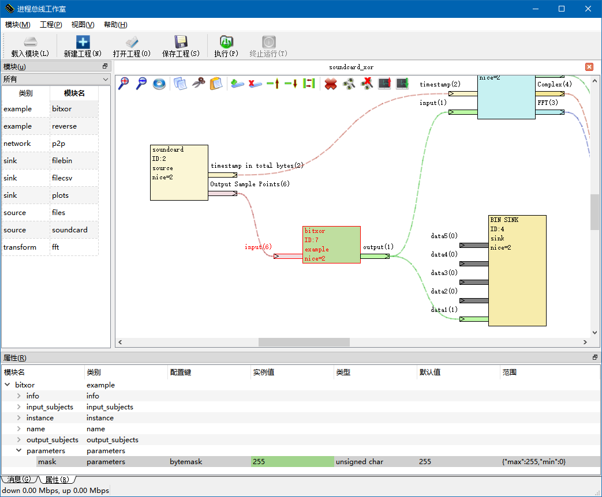


### 3.6 第一个Hello-world 模块的代码

我们把HelloWold模块的代码粘贴到这里，使用C++，可以非常方便的实现上述功能。
- 该代码没有使用任何标准C++之外的特性
- 事实上，在第四章您可以看到，我们已经为接入平台提前做好了不少简化工作。但简化工作会掩盖细节，下面的代码仍旧是最体现模块运行原理的好例子。


```cpp
#include <cstdio>
#include <string>
#include <cstring>
#include <cstdlib>
#ifdef WINNT
#include <io.h>
#include <fcntl.h>
#endif
using namespace std;
#define MAX_DTALEN 65536
int main(int argc, char * argv[])
{
	//In windows, stdio must be set to BINARY mode, to
	//prevent linebreak \\n\\r replace.
#ifdef WINNT
	setmode(fileno(stdout),O_BINARY);
	setmode(fileno(stdin),O_BINARY);
#endif
	bool bInfo = false, finished = false;
	int instance = 0;
	int sub_input = 0, sub_output = 0;
	char mask = 0;
	string function;
	//1. parse cmdline
	for (int i=1;i<argc;++i)
	{
		string arg_key = argv[i], arg_value = argv[i];
		int idx = arg_key.find('=');
		if (idx>=0 && idx<arg_key.size())
		{
			arg_key = arg_key.substr(0,idx);
			arg_value = arg_value.substr(idx+1);
		}
		if (arg_key=="--function")
			function = arg_value;
		else if (arg_key=="--information")
			bInfo = true;
		else if (arg_key=="--instance")
			instance = atoi(arg_value.c_str());
		else if (arg_key=="--data_in")
			sub_input = atoi(arg_value.c_str());
		else if (arg_key=="--data_out")
			sub_output = atoi(arg_value.c_str());
		else if (arg_key=="--mask")
			mask = atoi(arg_value.c_str());
		fprintf(stderr,"%s:%s\n",arg_key.c_str(),arg_value.c_str());
		fflush(stderr);
	}
	//2. function case
	if (bInfo)
	{
		//In this example, json file will be published with exe file.
		//We will return directly.  Or, you can output json here to stdout,
		//If you do not want to publish your json file.
		return 0;
	}
	else if (instance<=0 || function.length()==0)
		return -1;
	else
	{
		char header[4], data[MAX_DTALEN+1];
		memset(data,0,MAX_DTALEN+1);
		int n_sub = 0, n_path = 0, n_len = 0;
		while(false==finished)
		{
			fread(header,1,4,stdin);	//2.1 read header
			if (header[0]!=0x3C || header[1]!=0x5A || header[2]!=0x7E || header[3]!=0x69)
			{
				fprintf(stderr,"Bad header\n");
				break;
			}
			fread(&n_sub,sizeof(int),1,stdin);
			fread(&n_path,sizeof(int),1,stdin);
			fread(&n_len,sizeof(int),1,stdin);
			if (n_len<0 || n_len >MAX_DTALEN)
			{
				fprintf(stderr,"Bad length %d\n",n_len);
				break;
			}
			fread(data,sizeof(char),n_len,stdin);

			if (n_sub<=0)
			{
				if (strstr(data, "quit")!=nullptr)
				{
					finished = true;
					continue;
				}
			}
			else if (n_sub != sub_input)
				continue;

			if (function=="example_bitxor")
			{
				for (int i=0;i<n_len;++i)
					data[i] ^= mask;
			}
			else if (function=="example_reverse")
			{
				for (int i=0;i<n_len/2;++i)
				{
					char t = data[i];
					data[i] = data[n_len-1-i];
					data[n_len-1-i] = t;
				}
			}
			else
			{
				fprintf(stderr,"Unknown function %s\n",function.c_str());
				break;
			}
			fwrite(header,1,4,stdout);
			fwrite(&sub_output,sizeof(int),1,stdout);
			fwrite(&n_path,sizeof(int),1,stdout);
			fwrite(&n_len,sizeof(int),1,stdout);
			fwrite(data,sizeof(char),n_len,stdout);
			fflush(stdout);
		}
	}
	//3.exit
	return 0;
}

```

## 4. 开发指南

我们将以fftw为例子，介绍如何从0开始创建一个taskBus模块。

### 4.1 设计功能与撰写描述文件

创建一个模块的第一步，是设计功能，并确定接口、属性，撰写JSON文件。撰写JSON文件最快的方法是从例子修改，并保存为与可执行文件同名的json文件。使用UTF-8编码书写亚洲字符有利于加载速度。只要有JSON文件，即使模块没有完全实现，也可以在平台上看到效果。我们要设计的FFT模块，应该具备以下的结构：

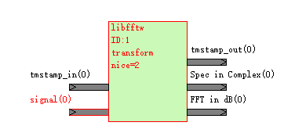

它具备时戳、信号两个输入接口（Subject）；具备时戳、复数形式、幅度谱三个输出接口（Subject）。此外，可以支持用户配置FFT的点数、输入信号的波段数、样点数据类型三个静态参数。这些静态参数在用户单击图标时，可以在“属性”一栏修改，类似下图：

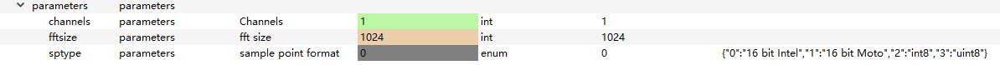

具备上述特性的功能描述文件如下：

```json
{
    "transform_fft":{
        "name":"libfftw",
        "parameters":{
		     "sptype":{
                "type":"enum",
                "tooltip":"sample point format",
                "default":0,
				"range":{
                    "0":"16 bit Intel",
                    "1":"16 bit Moto",
                    "2":"int8",
                    "3":"uint8"
				}
            },
             "channels":{
                "type":"int",
                "tooltip":"Channels",
                "default":1
            },		    
			"fftsize":{
                "type":"int",
                "tooltip":"fft size",
                "default":1024
            }

        },
        "input_subjects":
        {
            "signal":{
                "type":"byte",
                "tooltip":"signal"
            },
			"tmstamp_in":{
                "type":"unsigned long long",
                "tooltip":"tmstamp_in"
            }
        },
        "output_subjects":{           
            "FFT":{
                "type":"vector",
                "tooltip":"FFT in dB"
            },
            "Spec":{
                "type":"vector",
                "tooltip":"Spec in Complex"
            },
            "tmstamp_out":{
                "type":"unsigned long long",
                "tooltip":"tmstamp_out"
            }

        }
    }
}

```
一旦具备了上述JSON文件，只要搭配一个空白的可执行文件（文件名相同，扩展名不同），即可在平台载入并编辑——当然无法运行。

### 4.2 利用工具代码加快开发进度

如果您使用C#等特性丰富的语言，对命令行解析等操作会比较方便。对C++，平台提供了可直接加速开发速度的源代码，使用这些源码，会显著提高开发效率，简化代码量。

#### 4.2.1 命令行解释

实现模块功能的第一步，是获取命令行参数。您可以采用Helloworld的代码实现命令行解析，但那样做显得比较复杂。使用提供的类，命令行解析、提取变得非常简单。无论是Qt、C++还是MFC，均可以采取类似的措施。

```cpp
#include "cmdlineparser.h"
#include "tb_interface.h"
using namespace TASKBUS;
int main(int argc , char * argv[])
{
	init_client();
	cmdlineParser args(argc,argv);
	if (args.contains("information"))
		putjson();
	else if (args.contains("function","tranform_fft"))
	{
    	const int instance		= args.toInt("instance",0);
        const int isource		= args.toInt("signal",0);
        const int FFT		  	= args.toInt("FFT",0);
        const int Spec 			= args.toInt("Spec",0);
        const int itmstamp_in  = args.toInt("tmstamp_in",0);
        const int itmstamp_out = args.toInt("tmstamp_out",0);
        const int sptype	=	args.toInt("sptype",0);
        const int channels	=	args.toInt("channels",1);
		const int fftsize	=  args.toInt("fftsize",1024);
		//...work
	}
	else
		fprintf(stderr,"Error:Function does not exits.");
    return 0;
}
```
对Qt、MFC、C#的例子，可以参考范例代码。

#### 4.2.2 数据收发

taskBus的数据吞吐格式是固定的。其严格遵循下面的顺序：

|package| record | type |length(bytes) | meaning |
|--------|--------|--------|---------|---------|
|1| header |  unsigned char [4]|4  | 必须为0x3C,0x5A,0x7E,0x69，以便用WinHex等软件调试|
|1| subject_id|  int |4  | 0: Control commands, >0:user subjects, <0 reserved|
|1| path_id|  int |4  | >=0:user subjects, <0 reserved|
|1| data_len|  int |4  | >0, following data length in bytes|
|1| data| unsigned char |  data_len | >0, data in bytes|
|2| header |  unsigned char [4]|4  | 0x3C,0x5A,0x7E,0x69|
|2| subject_id|  int |4  | 0: Control commands, >0:user subjects, <0 reserved|
|2| path_id|  int |4  | >=0:user subjects, <0 reserved|
|2| data_len|  int |4  | >0, following data length in bytes|
|2| data| unsigned char |  data_len | >0, data in bytes|
|3...||||||


使用工具代码，可以直接完成数据收发。主要推送函数有：

```cpp
    void push_subject(
	    const unsigned int subject_id,
	    const unsigned int path_id,
	    const unsigned int data_length,
	    const unsigned char   *dataptr
	    );
    void push_subject(
	    const unsigned int subject_id,
	    const unsigned int path_id,
	    const char   *dataptr
	    );
    void push_subject(
	    const unsigned char   *allptr,
	    const unsigned int totalLength
	    );
    void push_subject(
	    const subject_package_header header,
	    const unsigned char   *dataptr
	    );
```

接收函数（阻塞）为：

```cpp
   std::vector<unsigned char> pull_subject(  subject_package_header * header  );
```

**性能说明：**该函数会直接返回一个向量，含有一个完整数据包（不包括头部）的数据内容。由于默认使用C++14以上标准，返回 std::vector<unsigned char> 并不会导致内存深度拷贝，而是触发右值引用与内存传递。

使用上述工具函数的收发代码片段如下：

```cpp
		while (false==bfinished)
		{
			subject_package_header header;
			vector<unsigned char> packagedta = pull_subject(&header);
			if (is_valid_header(header)==false)
            	break;
			if ( is_control_subject(header))
			{				
				if (strstr(control_subject(header,packagedta).c_str(),"\"quit\":")!=nullptr)
					bfinished = true;
			}
			else if (header.subject_id==source)
			{
            	//...fft
                //output
				if (FFT>0)
					push_subject(FFT,header.path_id,fftsize*sizeof(double),(const unsigned char *)vec_fft_abs.data());
				if (Spec>0)
					push_subject(Spec,header.path_id,fftsize*sizeof(double),(const unsigned char *)out);
			}
		}
```

#### 4.2.3 调试

为了一个简单的模块，从平台进程开始跟踪调试，需要在不同的语言、编译器开发的二进制机器代码中漫游，非常繁琐。幸运的是，taskBus提供了一套非常巧妙而简单的离线调试解决方案，使得您可以单独调试模块本身，并随时接入平台运行。

调试的核心思路是标准输入输出管道的重载。平台可以根据需要，把某个模块的输入输出数据、命令行启动参数等要素全部录制到磁盘上。而后，在调试平台时，只要指定录制文件夹，即可实现场景回放。

#####(1)录制
在主界面选中模块，单击“启动调试”按钮，会开启录制。

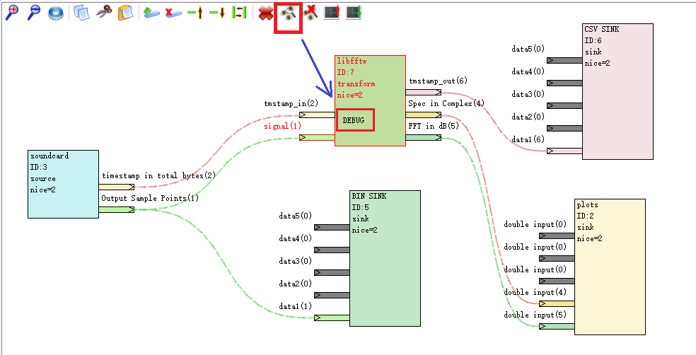

一旦整个项目开始运行，记录数据会源源不断地记录在 debug 文件夹。子文件夹的名字为当前的操作系统进程ID，文件夹下有3个文件，分别对应stdin,stdout,stderr。注意，为了捕获所有异常，平台会一直独占日志，直到下一次调试开始运行。因此，为了结束录制，需要关闭平台或者再次启动工程。

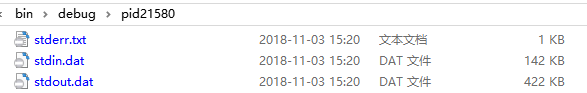

#####(2)回放与调试
回放与调试的关键技术是freopen的使用。这个特性能够在保持文件句柄不变的情况下，把实际来源重定向到文件。用户可以自己通过语句来实现，一旦下面这个语句被执行，数据吞吐的stdin将自动使用文件中录制的数据：

```cpp
	std::string fm_stdin = strpath + "/stdin.dat";
    freopen(fm_stdin.c_str(),"rb",stdin);
```

对于cpp，平台已经准备好了方便的工具函数。一个支持切换调试模式、正常模式的代码只需要在main入口添加几行代码：

```cpp
using namespace TASKBUS;
const int OFFLINEDEBUG = 0;
int main(int argc , char * argv[])
{
	init_client();
	cmdlineParser args;
	if (OFFLINEDEBUG==0)
		args.parser(argc,argv);
	else
	{
		auto ars = debug("debug/pid21580");
		args.parser(ars);
	}
    //...
}
```

在上面的代码中，将从debug/pid21580 读取先前录制的命令行参数、输入数据。这样，您就可以独立调试了。别忘了完成调试后，把调试开关OFFLINEDEBUG掷为0.

### 4.3 数据处理

在前文的例子里，数据的处理都是没有记忆的。对到来的数据，直接处理后输出，是最简单的情况。然而，很多场景下我们需要应对数据记忆与多路处理问题。对于一个数据流量很大或者处理耗时的操作，负荷控制也是要考虑的问题。-

#### 4.3.1 数据缓存建议

推荐使用STL库。

- 若需要缓存旧的数据，使用STL容器是非常合适的选择。
- 对于不同的通路（path_id），缓存应该是独立的。此时，std::map<path_id, cache> 会提供非常好的操作性。
- 使用嵌套 map, vector, list，能够实现非常复杂的动态数据结构。
- 使用智能指针“shared_ptr"，也是一个好的主意。

#### 4.3.2 负荷控制
与Gnuradio的拉取方式不同，taskBus的生产者会主动推送数据。计算资源充裕时，设计者不需要考虑负荷控制的问题。但是在进行耗时的处理时，若没有措施保护，瓶颈模块可能会导致整个平台的内存开销不断增加。生产者不断写入stdout, 平台输出到消费者的stdin，看似没有问题。实际上，在windows下，平台写入的是操作系统的缓存。消费者若无法及时消费缓存，缓存会持续增长。

出于灵活性考虑，taskBus把这个问题留给模块设计者。模块设计者可以通过至少两种简单的策略解决这个问题。

- 方法1，通过设置信号源的速率，确保信号以小于处理极限的速率生成。
- 方法2，消费者输出数据时戳，并向生产者回连，形成闭环。生产者检测回连时戳。若显著低于当前生产进度，则生产者调慢生产进度。

下面这个范例工程即采用了策略2. 技术细节参考范例工程 source_soundcard.

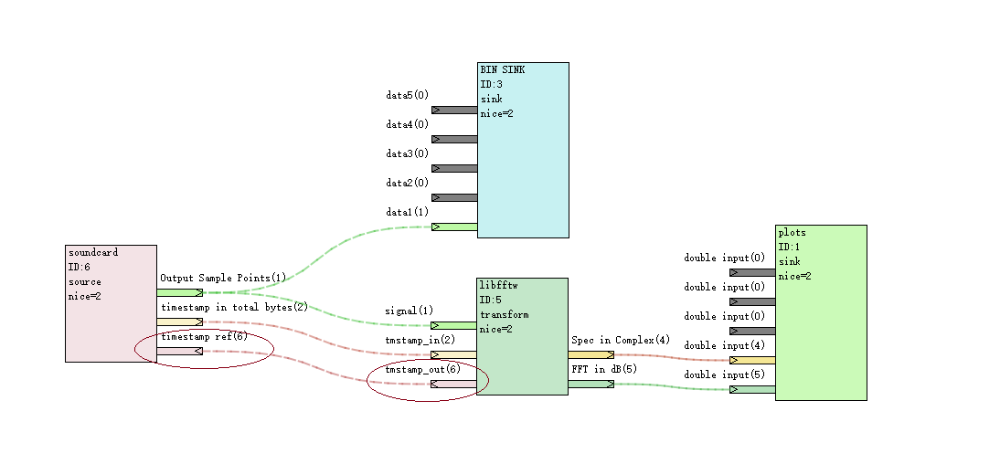

### 4.4 运行与发布

taskBus的运行时为绿色发布（copy-deployment）提供了遍历，开发者可参考下面的章节调整路径设置。

#### 4.4.1 路径策略

taskBus 的项目在启动时，会强制把当前路径设置到 taskBusPlatform 可执行文件所在的路径。taskBusPlatform 会读取同一文件夹下的 default_mods.text 预先加载所有的已知模块。这个文件中，每一行存储一个模块的可执行文件位置，一个范例如下所示：

```text
../../../examples/voice_spec.exe
modules/network_p2p.exe
modules/sink_file.exe
modules/example_helloworld.exe
modules/source_files.exe
modules/transform_fft.exe
modules/sink_SQL.exe
modules/source_soundcard.exe
modules/sink_plots.exe
```
taskBusPlatform 会尽量使用相对路径存储模块的位置，除非绝对路径的字符长度要小于相对路径。因此，对于一个需要发布的系统，可以把所有模块放在 taskBusPlatform 可执行文件所在的路径中，用文件夹 modules 或 subs 等子文件夹管理。如此操作后，拷贝到新的计算机上，无需设置即可运行啦。

#### 4.4.2 子工程与嵌套

taskBus允许工程作为整体，被其他工程引用。所有悬空的引脚都会被分配临时ID，并暴露出来供外部工程链接。 以声卡的FFT为例，我们可以把声卡、FFT合成为一个“声音频谱”模块。

#####（1） 创建子工程

新建一个子工程，其结构如下：

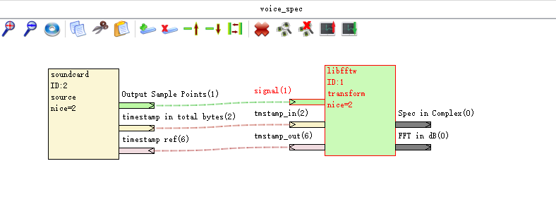

- 这个子项目包括两个模块，声卡模块与fft模块。
- fft模块的输出管脚悬空，作为子项目的外部接口。
- 如果有两个相同名称的悬空接口，会使用对应进程分配的ID做区分。

保存这个子项目为tbj文件，如“voice_spec.tbj”。

#####（2） 附加包装器

把平台自带的包装器“subtask_warpper.exe”拷贝到“voice_spec.tbj”相同的文件夹，命名为“voice_spec.exe”
- voice_spec.exe 会自动读取 voice_spec.tbj，并告诉平台自己的接口。
- 在Linux下，没有exe扩展名。

#####（3） 附加默认模块加载脚本

由于voice_spec需要自行加载模块，需要把 taskBusPlatform.exe 所在文件夹下的 default_mods.text 拷贝到“voice_spec.tbj”相同的文件夹，命名为“voice_spec.text”。
- 由于平台的当前运行路径永远是 taskBusPlatform.exe 所在路径，因此，文件voice_spec.text中的相对路径仍旧与 default_mods.text 不变。用户不需要额外编辑。
- 但仍旧需要检视文件 文件voice_spec.text, 以便清除无用的条目。
- **尤其需要注意，文件voice_spec.text中不能包含voice_spec模块的入口行。这样会导致递归加载，启动上百个子进程拖慢系统**

完成2、3两个步骤后，文件夹看起来是这样的：


文件voice_spec.text被修改为：

```text
modules/source_soundcard.exe
modules/transform_fft.exe
```

#####（4）载入子项目模块

在平台中载入子项目模块"voice_spec.exe"后，可以把该模块作为整体拖入设计区：

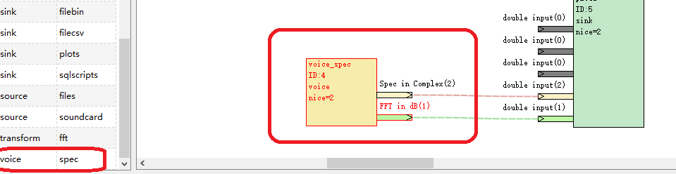

- 双击“voice_spec” 图标，会打开子项目。

### 4.5 多平台、分布式及扩展
taskBus 核心采用 Qt 开发，是跨平台的结构框架，可以在支持Qt的所有平台上运行。同时，通过引入相应的模块，taskBus 可以较为方便地实现分布式计算。在代码示例中，含有基于TCP的点对点传输模块、接受SQL脚本的数据库记录模块。

taskBus除了支持使用 C++, C#, VB等编译型语言，还可以通过包装器直接引用 python，lua，perl，ruby，matlab 作为模块，非常灵活。

具体例子参考附带代码。

## 5 关于taskBus

**版权保护与商业用途**

taskBus 本身是开放标准的软件体系，遵循LGPL协议，但不规定模块的许可类型。
若开发者发布的是商用模块，要自行完成注册认证、激活等功能设计。
TaskBus 由 goldenhawking studio 开发，欢迎活跃开发者加入！

邮箱：goldenhawking@163.com
